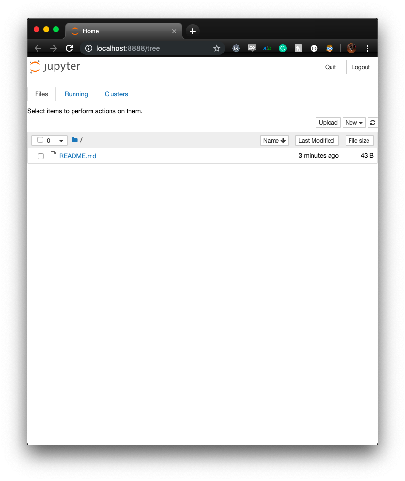

# Local Installation

First, lets make sure we have python installed
```
$ python --version
Python 2.7.15
```
(Note: Python 2 is the default version on my current version of MacOS... don't worry we will be using Python 3 for the rest of the progression)

Second, lets install Jupyter:

```
$ pip install jupyter
```

Lots of things get installed.

Now we can launch the Jupyter server:

```
$ jupyter notebook
```
This will start the Jupyter server on your machine, open a browser, and connect to it!


