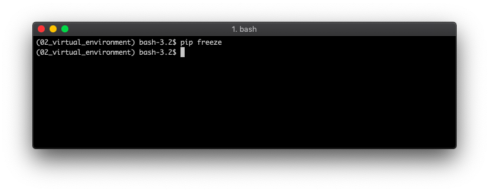

# Virtual Environment

There are times when you need to use specific versions of dependencies for different projects. To do this we can use virtual environments. There are a variety of tools to manage virtual environments including venv for Python3.3+.

In this example I will use pipenv: https://docs.pipenv.org/en/latest/

On MacOS pipenv can be installed using homebrew with:

`$ brew install pipenv`

After installing, we can create a new virtual environment:

`pipenv --python 3.7`

And then activate it:

`pipenv shell`

