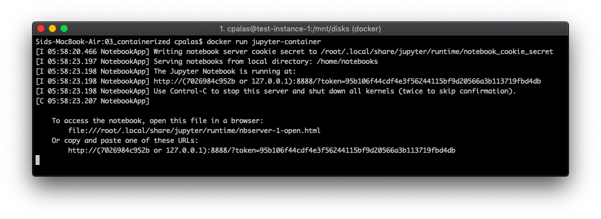

# Docker Container

In the last step we used a virtual environment to allow us to isolate this project from other python projects on the same system. In this step we take that to the next level by creating a container image, packaging up all the necessary code, runtime, system tools, etc...

This is great because the container images is portable, meaning we can run it on our local system (using Docker) or in the cloud (using something like Google's Container Optimized OS). That being said, it does add some complexity regarding connecting to the notebook running inside the container and getting files from our computer to/from the container.

Before starting we need to install Docker: https://docs.docker.com/docker-for-mac/install/

After that, the first step is to create a Dockerfile. See `./Dockerfile` for a minimal example. Jupyter actually maintains a variety of container images that can be found here: https://jupyter-docker-stacks.readthedocs.io/en/latest/using/selecting.html which are preconfigured with various packages to cover many common use cases.

This Dockerfile then needs to be built into a container image:

`docker build ./ --tag jupyter-container`

Once built, we can run the following command to run the container within docker:

`docker run jupyter-container`



Okay, great! We have a notebook, running within the container... Now what? We can't actually connect to the notebook because localhost inside the container is different from localhost on our host system. To handle this, we need to forward network traffic to/from the container:

`docker run -p 8888:8888 -v $PWD/notebooks:/home/notebooks jupyter-container`

The `-p 8888:8888` forwards traffic over port 8888 (host and container) so that we can connect to the notebook server by navigating to localhost as before. You may have also noticed the `-v $PWD/notebooks:/home/notebooks` this mounts the `./notebooks` directory into the container so that files on my local hard drive can be seen inside the container and files created/modified within the container will persist once the container is terminated.

Finally, running that docker command, opening Chrome, copy/pasting the token into the browser is a bit inconvenient. The following (UGLY) command takes care of those steps together so only a single command needs to be to launch a functional notebook session:

```
docker run -p 8888:8888 -v $PWD/notebooks:/home/notebooks jupyter-container & \
    sleep 5 && \
    open -a "Google Chrome" $(echo http://localhost$((docker exec -it $( \
        docker ps | \
        grep jupyter-container | \
        cut -d ' ' -f1) jupyter notebook list) | \
        grep http | \
        cut -c 15- | \
        cut -d ' ' -f1) \
    )
```
